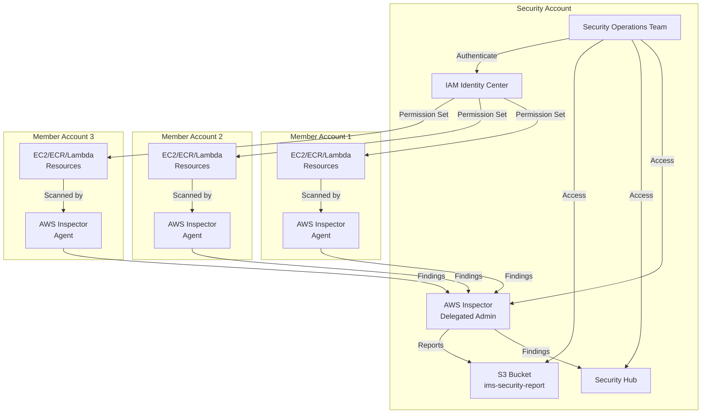

# Granular AWS Inspector Permission Sets for Security Operations Team

## Multi-Account AWS Inspector Architecture



## Access Requirements Analysis

In a multi-account AWS Inspector deployment, the security operations team requires different levels of access depending on their roles and responsibilities. The primary question is whether access to the security account alone is sufficient or if direct access to member accounts is also necessary.

### Security Account Access Only (Centralized Model)

**Advantages:**
- Simplified access management
- Consolidated view of findings
- Reduced permission complexity
- Lower risk of privilege escalation

**Limitations:**
- Limited ability to investigate resource context
- Cannot directly remediate issues in member accounts
- Dependency on accurate finding data aggregation

### Member Account Access (Distributed Model)

**Advantages:**
- Direct investigation of resources in context
- Ability to perform immediate remediation
- Access to resource-specific details not in findings
- Can validate findings against actual resources

**Limitations:**
- More complex access management
- Increased security risk surface
- More difficult to maintain least privilege

## Recommended Access Model: IAM Identity Center Permission Sets

For most security operations teams, using IAM Identity Center with multiple permission sets is recommended:

1. **Primary permission set for the security account** for day-to-day operations
2. **Specialized permission sets for member accounts** for investigation and remediation
3. **Role-based permissions** tailored to specific job functions

## S3 Bucket Policy for AWS Inspector Reports: Explained

```json
{
  "Version": "2012-10-17",
  "Statement": [
    {
      "Sid": "AllowInspectorReportUploads",
      "Effect": "Allow",
      "Principal": {
        "Service": "inspector2.amazonaws.com"
      },
      "Action": [
        "s3:PutObject",
        "s3:PutObjectAcl",
        "s3:AbortMultipartUpload"
      ],
      "Resource": "arn:aws:s3:::ims-security-report/*",
      "Condition": {
        "StringEquals": {
          "aws:SourceAccount": "${aws:PrincipalAccount}"
        },
        "ArnLike": {
          "aws:SourceArn": "arn:aws:inspector2:*:${aws:PrincipalAccount}:report/*"
        }
      }
    }
  ]
}
```

### How This S3 Bucket Policy Works

This policy controls how AWS Inspector can upload reports to the `ims-security-report` bucket in your security account:

1. **Who can access**: Only the AWS Inspector service (`inspector2.amazonaws.com`) can perform the allowed actions.

2. **What they can do**: The policy allows three specific operations:
   - `s3:PutObject`: Upload report files
   - `s3:PutObjectAcl`: Set permissions on uploaded reports
   - `s3:AbortMultipartUpload`: Cancel incomplete uploads

3. **Where they can do it**: These actions are restricted to objects within the `ims-security-report` bucket.

4. **Security conditions**: The `Condition` block adds critical security constraints:
   - `${aws:PrincipalAccount}` is a variable that represents the AWS account ID making the request
   - In a delegated admin setup, this will be the security account ID
   - The policy ensures the source account matches the account in the ARN

### Account Access Breakdown

In your multi-account setup:

1. **Who can generate reports**: 
   - Only the security account (delegated admin) can generate reports
   - Member accounts do not generate reports directly; their findings flow to the delegated admin

2. **What `${aws:PrincipalAccount}` means**:
   - It will be the security account ID (delegated admin)
   - The variable dynamically resolves to the account ID of the AWS service making the request

3. **Access pattern**:
   - AWS Inspector in the security account aggregates findings from all accounts
   - When generating reports, Inspector in the security account writes to the S3 bucket
   - The condition ensures only Inspector from the security account can write to the bucket

This policy implements the principle of least privilege while allowing Inspector to function properly in a multi-account environment. The security conditions prevent confused deputy attacks by ensuring the service can only act on behalf of the account it's running in.

## Security Account Permission Sets

### 1. Inspector Security Analyst (Day-to-Day Monitoring)

```json
{
  "Version": "2012-10-17",
  "Statement": [
    {
      "Effect": "Allow",
      "Action": [
        "inspector2:List*",
        "inspector2:Get*",
        "inspector2:Describe*",
        "inspector2:BatchGet*",
        "inspector2:ListFindings",
        "inspector2:ListCoverage",
        "inspector2:ListAccountPermissions"
      ],
      "Resource": "*"
    },
    {
      "Effect": "Allow",
      "Action": [
        "inspector2:UpdateFilter",
        "inspector2:CreateFilter",
        "inspector2:DeleteFilter"
      ],
      "Resource": "*"
    },
    {
      "Effect": "Allow",
      "Action": [
        "s3:GetObject",
        "s3:ListBucket"
      ],
      "Resource": [
        "arn:aws:s3:::ims-security-report",
        "arn:aws:s3:::ims-security-report/*"
      ]
    }
  ]
}
```

### 2. Inspector Vulnerability Manager (Triage & Remediation)

```json
{
  "Version": "2012-10-17",
  "Statement": [
    {
      "Effect": "Allow",
      "Action": [
        "inspector2:List*",
        "inspector2:Get*",
        "inspector2:Describe*",
        "inspector2:BatchGet*"
      ],
      "Resource": "*"
    },
    {
      "Effect": "Allow",
      "Action": [
        "inspector2:UpdateFindings",
        "inspector2:CreateFindingsReport",
        "inspector2:CreateFilter",
        "inspector2:UpdateFilter",
        "inspector2:DeleteFilter"
      ],
      "Resource": "*"
    },
    {
      "Effect": "Allow",
      "Action": [
        "s3:GetObject",
        "s3:ListBucket",
        "s3:PutObject"
      ],
      "Resource": [
        "arn:aws:s3:::ims-security-report",
        "arn:aws:s3:::ims-security-report/*"
      ]
    },
    {
      "Effect": "Allow",
      "Action": [
        "ec2:DescribeInstances",
        "ecr:DescribeImages",
        "lambda:GetFunction"
      ],
      "Resource": "*"
    }
  ]
}
```

### 3. Inspector Configuration Manager (Service Administration)

```json
{
  "Version": "2012-10-17",
  "Statement": [
    {
      "Effect": "Allow",
      "Action": [
        "inspector2:List*",
        "inspector2:Get*",
        "inspector2:Describe*"
      ],
      "Resource": "*"
    },
    {
      "Effect": "Allow",
      "Action": [
        "inspector2:Enable",
        "inspector2:Disable",
        "inspector2:UpdateConfiguration",
        "inspector2:UpdateCisScanConfiguration",
        "inspector2:UpdateEc2Configuration",
        "inspector2:UpdateEcrConfiguration",
        "inspector2:UpdateLambdaConfiguration",
        "inspector2:AssociateMembers",
        "inspector2:DisassociateMembers"
      ],
      "Resource": "*"
    },
    {
      "Effect": "Allow",
      "Action": [
        "organizations:ListAccounts",
        "organizations:DescribeOrganization"
      ],
      "Resource": "*"
    }
  ]
}
```

### 4. Inspector Reporting Specialist (Compliance & Executive Reporting)

```json
{
  "Version": "2012-10-17",
  "Statement": [
    {
      "Effect": "Allow",
      "Action": [
        "inspector2:List*",
        "inspector2:Get*",
        "inspector2:BatchGet*"
      ],
      "Resource": "*"
    },
    {
      "Effect": "Allow",
      "Action": [
        "inspector2:CreateFindingsReport",
        "inspector2:GetFindingsReportStatus"
      ],
      "Resource": "*"
    },
    {
      "Effect": "Allow",
      "Action": [
        "s3:GetObject",
        "s3:ListBucket",
        "s3:PutObject"
      ],
      "Resource": [
        "arn:aws:s3:::ims-security-report",
        "arn:aws:s3:::ims-security-report/*"
      ]
    },
    {
      "Effect": "Allow",
      "Action": [
        "quicksight:CreateAnalysis",
        "quicksight:UpdateAnalysis",
        "quicksight:CreateDashboard",
        "quicksight:UpdateDashboard"
      ],
      "Resource": "*"
    }
  ]
}
```

## Member Account Permission Sets

Instead of cross-account roles, you can create these permission sets in IAM Identity Center to be assigned directly to users for member account access:

### 1. Inspector Remediation Specialist

```json
{
  "Version": "2012-10-17",
  "Statement": [
    {
      "Effect": "Allow",
      "Action": [
        "inspector2:List*",
        "inspector2:Get*",
        "inspector2:Describe*"
      ],
      "Resource": "*"
    },
    {
      "Effect": "Allow",
      "Action": [
        "ec2:DescribeInstances",
        "ec2:CreateTags",
        "ec2:CreateSnapshot",
        "ssm:SendCommand",
        "ssm:GetCommandInvocation",
        "ssm:DescribeInstanceInformation"
      ],
      "Resource": "*"
    },
    {
      "Effect": "Allow",
      "Action": [
        "ecr:DescribeImages",
        "ecr:BatchGetImage",
        "ecr:PutImageScanningConfiguration"
      ],
      "Resource": "*"
    },
    {
      "Effect": "Allow",
      "Action": [
        "lambda:GetFunction",
        "lambda:UpdateFunctionCode",
        "lambda:GetLayerVersion"
      ],
      "Resource": "*"
    }
  ]
}
```

### 2. Inspector Read-Only Investigator

```json
{
  "Version": "2012-10-17",
  "Statement": [
    {
      "Effect": "Allow",
      "Action": [
        "inspector2:List*",
        "inspector2:Get*",
        "inspector2:Describe*"
      ],
      "Resource": "*"
    },
    {
      "Effect": "Allow",
      "Action": [
        "ec2:DescribeInstances",
        "ec2:DescribeImages",
        "ec2:DescribeNetworkInterfaces",
        "ec2:DescribeSecurityGroups"
      ],
      "Resource": "*"
    },
    {
      "Effect": "Allow",
      "Action": [
        "ecr:DescribeImages",
        "ecr:DescribeRepositories"
      ],
      "Resource": "*"
    },
    {
      "Effect": "Allow",
      "Action": [
        "lambda:GetFunction",
        "lambda:GetPolicy",
        "lambda:ListVersionsByFunction"
      ],
      "Resource": "*"
    },
    {
      "Effect": "Allow",
      "Action": [
        "ssm:DescribeInstanceInformation",
        "ssm:ListInventoryEntries",
        "ssm:GetInventory"
      ],
      "Resource": "*"
    }
  ]
}
```

### 3. Emergency Patching Specialist

```json
{
  "Version": "2012-10-17",
  "Statement": [
    {
      "Effect": "Allow",
      "Action": [
        "ssm:SendCommand",
        "ssm:GetCommandInvocation",
        "ssm:DescribeInstanceInformation",
        "ssm:CreateAssociation",
        "ssm:StartAssociationsOnce"
      ],
      "Resource": "*",
      "Condition": {
        "StringEquals": {
          "ssm:DocumentName": [
            "AWS-RunPatchBaseline",
            "AWS-InstallMissingWindowsUpdates",
            "AWS-ConfigureWindowsUpdate"
          ]
        }
      }
    },
    {
      "Effect": "Allow",
      "Action": [
        "ec2:DescribeInstances",
        "ec2:CreateTags"
      ],
      "Resource": "*"
    }
  ]
}
```

## Conclusion: Using Permission Sets vs. Cross-Account Roles

Using IAM Identity Center permission sets instead of cross-account roles offers several advantages:

**Advantages of Permission Sets:**
- **Centralized management** of all permissions through IAM Identity Center
- **Simplified user experience** with single sign-on to all accounts
- **Consistent access control** across the organization
- **Easier permission updates** through permission set modifications
- **Better visibility** into who has access to which accounts
- **Session management** with configurable session durations
- **Reduced credential management** for users

**When to use this approach:**
- When your organization is using AWS Organizations
- When you have IAM Identity Center already configured
- When you need to grant multiple team members access to multiple accounts
- When you want to enforce consistent access patterns

## Implementation Best Practices

1. **Create permission set groups** based on job functions
2. **Assign multiple permission sets** to users based on their responsibilities
3. **Use session duration limits** for sensitive operations
4. **Enable AWS CloudTrail** for comprehensive audit trails
5. **Create custom dashboards** in Security Hub for visibility
6. **Implement attribute-based access control (ABAC)** using tags
7. **Regularly review permissions** and remove unnecessary access
8. **Configure MFA** for all IAM Identity Center users
9. **Use just-in-time access** for emergency remediation permissions
