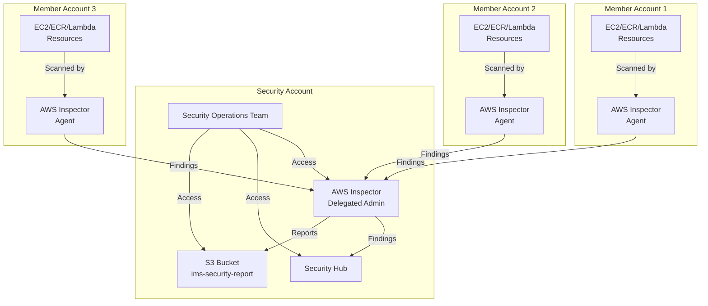

# Granular AWS Inspector Permission Sets for Security Operations Team

## Multi-Account AWS Inspector Architecture



## Access Requirements Analysis

In a multi-account AWS Inspector deployment, the security operations team requires different levels of access depending on their roles and responsibilities. The primary question is whether access to the security account alone is sufficient or if direct access to member accounts is also necessary.

### Security Account Access Only (Centralized Model)

**Advantages:**
- Simplified access management
- Consolidated view of findings
- Reduced permission complexity
- Lower risk of privilege escalation

**Limitations:**
- Limited ability to investigate resource context
- Cannot directly remediate issues in member accounts
- Dependency on accurate finding data aggregation

### Member Account Access (Distributed Model)

**Advantages:**
- Direct investigation of resources in context
- Ability to perform immediate remediation
- Access to resource-specific details not in findings
- Can validate findings against actual resources

**Limitations:**
- More complex access management
- Increased security risk surface
- Requires cross-account role management
- More difficult to maintain least privilege

## Recommended Access Model: Hybrid Approach

For most security operations teams, a hybrid approach is recommended:

1. **Primary access through the security account** for day-to-day operations
2. **Break-glass access to member accounts** for investigation and remediation
3. **Role-based permissions** tailored to specific job functions

## S3 Bucket Policy for Inspector Reports

```json
{
  "Version": "2012-10-17",
  "Statement": [
    {
      "Sid": "AllowInspectorReportUploads",
      "Effect": "Allow",
      "Principal": {
        "Service": "inspector2.amazonaws.com"
      },
      "Action": [
        "s3:PutObject",
        "s3:PutObjectAcl",
        "s3:AbortMultipartUpload"
      ],
      "Resource": "arn:aws:s3:::ims-security-report/*",
      "Condition": {
        "StringEquals": {
          "aws:SourceAccount": "${aws:PrincipalAccount}"
        },
        "ArnLike": {
          "aws:SourceArn": "arn:aws:inspector2:*:${aws:PrincipalAccount}:report/*"
        }
      }
    }
  ]
}
```

## Role-Based Permission Sets

### 1. Inspector Security Analyst (Day-to-Day Monitoring)

```json
{
  "Version": "2012-10-17",
  "Statement": [
    {
      "Effect": "Allow",
      "Action": [
        "inspector2:List*",
        "inspector2:Get*",
        "inspector2:Describe*",
        "inspector2:BatchGet*",
        "inspector2:ListFindings",
        "inspector2:ListCoverage",
        "inspector2:ListAccountPermissions"
      ],
      "Resource": "*"
    },
    {
      "Effect": "Allow",
      "Action": [
        "inspector2:UpdateFilter",
        "inspector2:CreateFilter",
        "inspector2:DeleteFilter"
      ],
      "Resource": "*"
    },
    {
      "Effect": "Allow",
      "Action": [
        "s3:GetObject",
        "s3:ListBucket"
      ],
      "Resource": [
        "arn:aws:s3:::ims-security-report",
        "arn:aws:s3:::ims-security-report/*"
      ]
    }
  ]
}
```

### 2. Inspector Vulnerability Manager (Triage & Remediation)

```json
{
  "Version": "2012-10-17",
  "Statement": [
    {
      "Effect": "Allow",
      "Action": [
        "inspector2:List*",
        "inspector2:Get*",
        "inspector2:Describe*",
        "inspector2:BatchGet*"
      ],
      "Resource": "*"
    },
    {
      "Effect": "Allow",
      "Action": [
        "inspector2:UpdateFindings",
        "inspector2:CreateFindingsReport",
        "inspector2:CreateFilter",
        "inspector2:UpdateFilter",
        "inspector2:DeleteFilter"
      ],
      "Resource": "*"
    },
    {
      "Effect": "Allow",
      "Action": [
        "s3:GetObject",
        "s3:ListBucket",
        "s3:PutObject"
      ],
      "Resource": [
        "arn:aws:s3:::ims-security-report",
        "arn:aws:s3:::ims-security-report/*"
      ]
    },
    {
      "Effect": "Allow",
      "Action": [
        "ec2:DescribeInstances",
        "ecr:DescribeImages",
        "lambda:GetFunction"
      ],
      "Resource": "*"
    }
  ]
}
```

### 3. Inspector Configuration Manager (Service Administration)

```json
{
  "Version": "2012-10-17",
  "Statement": [
    {
      "Effect": "Allow",
      "Action": [
        "inspector2:List*",
        "inspector2:Get*",
        "inspector2:Describe*"
      ],
      "Resource": "*"
    },
    {
      "Effect": "Allow",
      "Action": [
        "inspector2:Enable",
        "inspector2:Disable",
        "inspector2:UpdateConfiguration",
        "inspector2:UpdateCisScanConfiguration",
        "inspector2:UpdateEc2Configuration",
        "inspector2:UpdateEcrConfiguration",
        "inspector2:UpdateLambdaConfiguration",
        "inspector2:AssociateMembers",
        "inspector2:DisassociateMembers"
      ],
      "Resource": "*"
    },
    {
      "Effect": "Allow",
      "Action": [
        "organizations:ListAccounts",
        "organizations:DescribeOrganization"
      ],
      "Resource": "*"
    }
  ]
}
```

### 4. Inspector Reporting Specialist (Compliance & Executive Reporting)

```json
{
  "Version": "2012-10-17",
  "Statement": [
    {
      "Effect": "Allow",
      "Action": [
        "inspector2:List*",
        "inspector2:Get*",
        "inspector2:BatchGet*"
      ],
      "Resource": "*"
    },
    {
      "Effect": "Allow",
      "Action": [
        "inspector2:CreateFindingsReport",
        "inspector2:GetFindingsReportStatus"
      ],
      "Resource": "*"
    },
    {
      "Effect": "Allow",
      "Action": [
        "s3:GetObject",
        "s3:ListBucket",
        "s3:PutObject"
      ],
      "Resource": [
        "arn:aws:s3:::ims-security-report",
        "arn:aws:s3:::ims-security-report/*"
      ]
    },
    {
      "Effect": "Allow",
      "Action": [
        "quicksight:CreateAnalysis",
        "quicksight:UpdateAnalysis",
        "quicksight:CreateDashboard",
        "quicksight:UpdateDashboard"
      ],
      "Resource": "*"
    }
  ]
}
```

## Cross-Account Access for Remediation

For security team members who need to investigate and remediate issues in member accounts, create a cross-account role with appropriate permissions:

```json
{
  "Version": "2012-10-17",
  "Statement": [
    {
      "Effect": "Allow",
      "Principal": {
        "AWS": "arn:aws:iam::SECURITY_ACCOUNT_ID:role/InspectorRemediationRole"
      },
      "Action": "sts:AssumeRole",
      "Condition": {
        "StringEquals": {
          "aws:PrincipalOrgID": "o-ORGANIZATION_ID"
        }
      }
    }
  ]
}
```

## Conclusion: Is Security Account Access Sufficient?

**For most day-to-day operations**, access to the security account with Inspector delegated administrator is sufficient. The security operations team can:

- View all findings across the organization
- Generate reports and dashboards
- Configure Inspector settings
- Manage suppression rules and filters

**However, for effective remediation and investigation**, limited access to member accounts is necessary. This should be implemented through:

1. **Cross-account roles** with specific permissions
2. **Just-in-time access** with approval workflows
3. **Session monitoring** for all cross-account activities

The ideal approach is to provide primary access through the security account for monitoring and reporting, with controlled, audited access to member accounts for remediation activities. This balances operational efficiency with security best practices.

## Implementation Best Practices

1. **Use AWS IAM Identity Center** to manage permission sets
2. **Implement attribute-based access control (ABAC)** using tags
3. **Enable AWS CloudTrail** for comprehensive audit trails
4. **Create custom dashboards** in Security Hub for visibility
5. **Automate remediation workflows** where possible to reduce the need for direct member account access
6. **Regularly review and rotate credentials** for cross-account access
7. **Implement session duration limits** for sensitive operations
