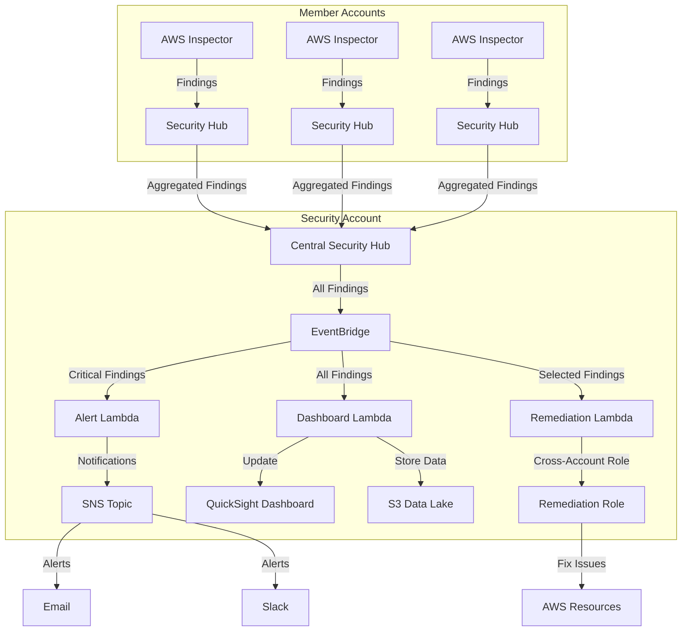

# Multi-Account Security Posture Management with AWS Inspector

This demo showcases how to implement a centralized vulnerability management solution across multiple AWS accounts using AWS Inspector, Security Hub, and Lambda functions.

## Architecture

