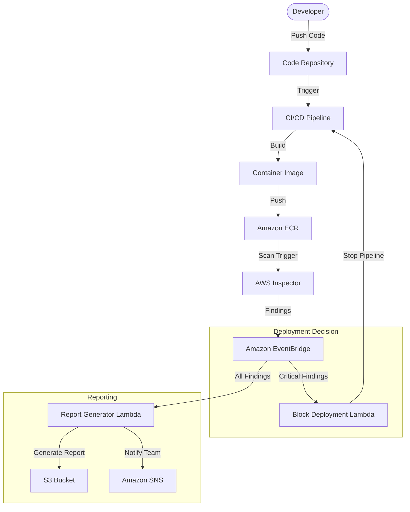

# DevSecOps Pipeline Integration with AWS Inspector

This demo showcases how to integrate AWS Inspector into a DevSecOps pipeline to scan container images during the CI/CD process, block deployments with critical vulnerabilities, and generate security reports for development teams.

## Architecture

