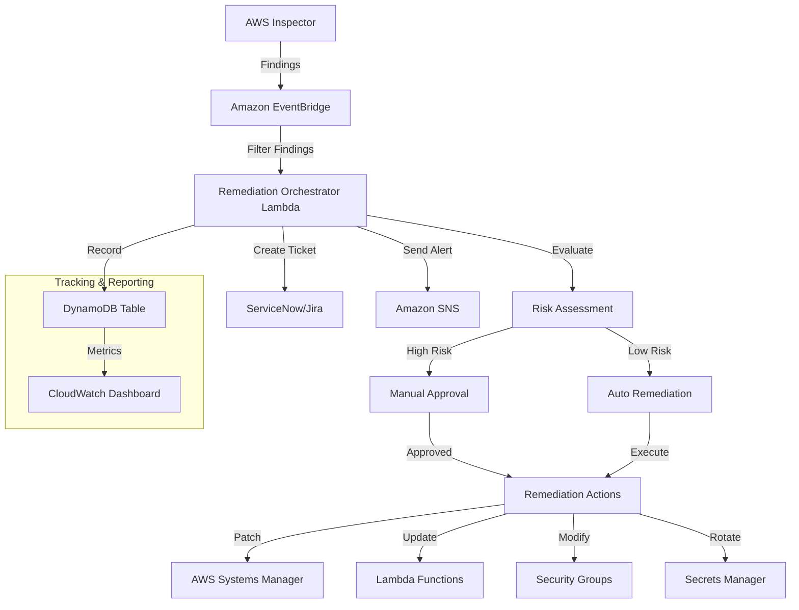

# Automated Remediation Workflows with AWS Inspector

This demo showcases how to implement automated remediation workflows for vulnerabilities detected by AWS Inspector.

## Architecture

```mermaid
flowchart TD
    Inspector[AWS Inspector] -->|Findings| EventBridge[Amazon EventBridge]
    EventBridge -->|Filter Findings| RemediationOrchestrator[Remediation Orchestrator Lambda]
    
    RemediationOrchestrator -->|Evaluate| RiskAssessment[Risk Assessment]
    RiskAssessment -->|High Risk| ManualApproval[Manual Approval]
    RiskAssessment -->|Low Risk| AutoRemediation[Auto Remediation]
    
    ManualApproval -->|Approved| RemediationActions[Remediation Actions]
    AutoRemediation -->|Execute| RemediationActions
    
    RemediationActions -->|Patch| SSM[AWS Systems Manager]
    RemediationActions -->|Update| Lambda[Lambda Functions]
    RemediationActions -->|Modify| SecurityGroups[Security Groups]
    RemediationActions -->|Rotate| Secrets[Secrets Manager]
    
    RemediationOrchestrator -->|Create Ticket| ServiceNow[ServiceNow/Jira]
    RemediationOrchestrator -->|Send Alert| SNS[Amazon SNS]
    
    subgraph "Tracking & Reporting"
        DynamoDB[DynamoDB Table]
        CloudWatchDashboard[CloudWatch Dashboard]
    end
    
    RemediationOrchestrator -->|Record| DynamoDB
    DynamoDB -->|Metrics| CloudWatchDashboard
```
