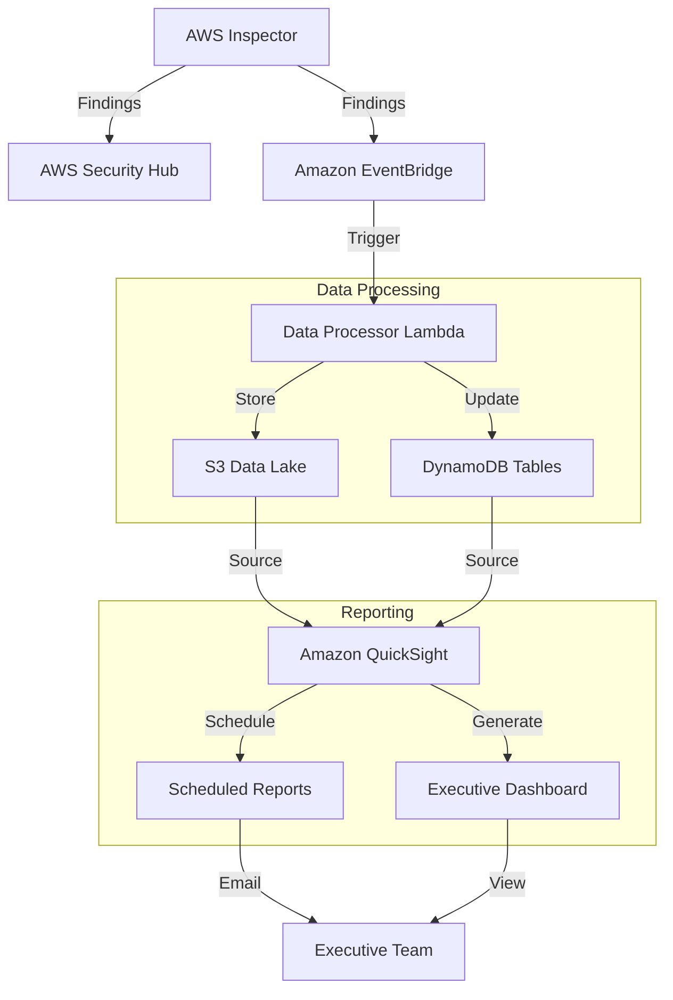

# Executive Security Reporting with AWS Inspector

This demo showcases how to create executive-level security reports and dashboards using AWS Inspector findings, providing actionable insights for leadership teams.

## Architecture

