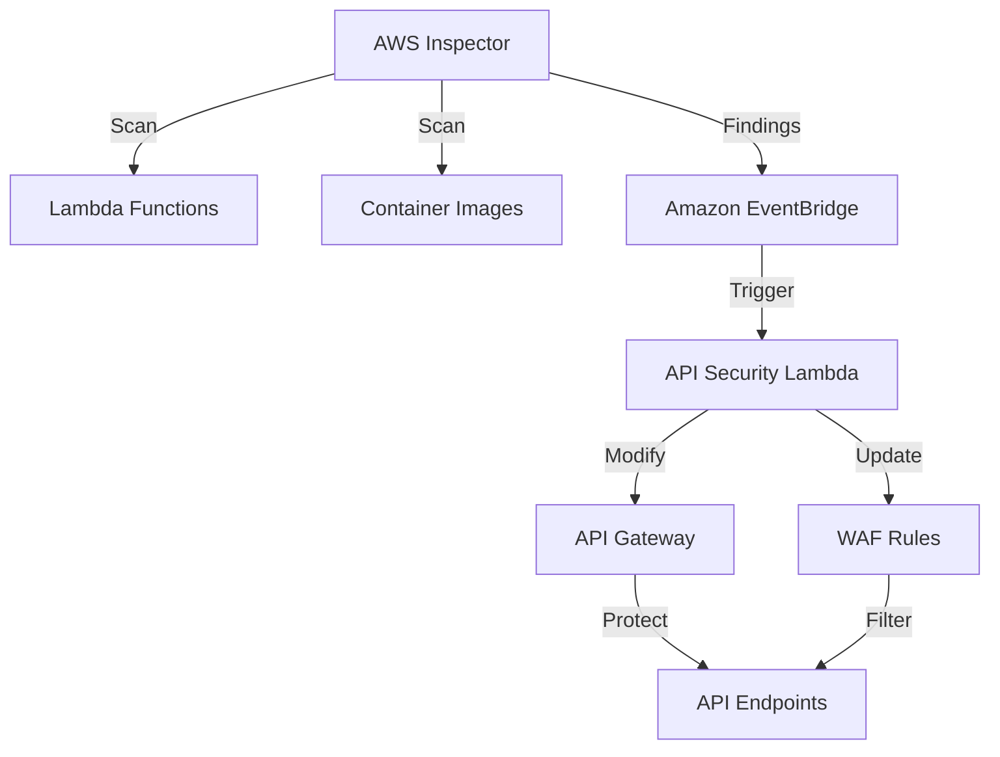

 Secure API Access with AWS Inspector

This demo showcases how to implement secure API access patterns using AWS Inspector to detect and prevent vulnerabilities in API components.

## Architecture

