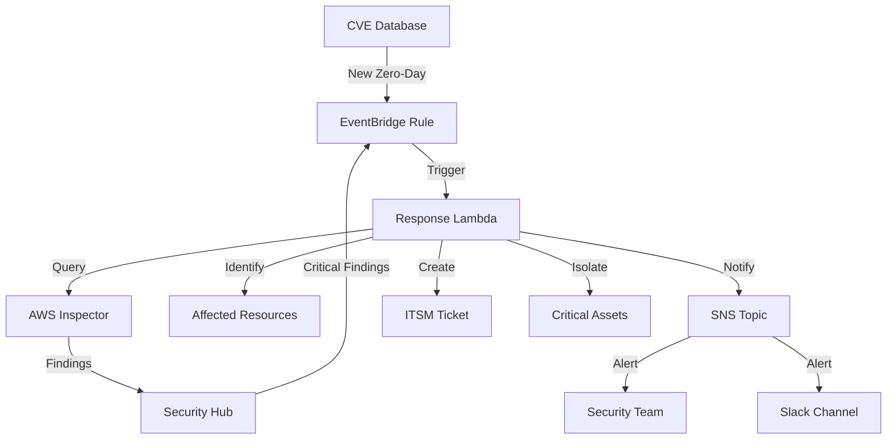

# Zero-Day Vulnerability Response with AWS Inspector

This demo showcases how to implement an automated zero-day vulnerability response system using AWS Inspector.

## Architecture

```mermaid
flowchart TD
    CVE[CVE Database] -->|New Zero-Day| EventBridge[EventBridge Rule]
    Inspector[AWS Inspector] -->|Findings| SecurityHub[Security Hub]
    SecurityHub -->|Critical Findings| EventBridge
    
    EventBridge -->|Trigger| ResponseFunction[Response Lambda]
    ResponseFunction -->|Query| Inspector
    ResponseFunction -->|Identify| AffectedResources[Affected Resources]
    
    ResponseFunction -->|Notify| SNS[SNS Topic]
    ResponseFunction -->|Create| Ticket[ITSM Ticket]
    ResponseFunction -->|Isolate| CriticalAssets[Critical Assets]
    
    SNS -->|Alert| SecurityTeam[Security Team]
    SNS -->|Alert| Slack[Slack Channel]
```
